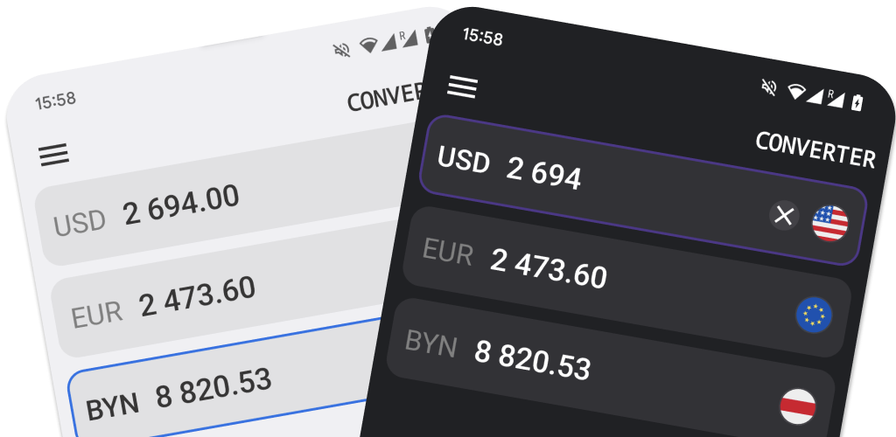

### Key features:
- Performant and intuitive UI
- Support for the dark mode. Follow the system color scheme
- Large list of supported currencies: 103 of Fiat and 44 of Crypto
- Cross-currency conversion
- Support for tablet layout
- Share the result of conversion in the native dialog
- Widget with favorite currencies(only iOS) 

Application is built across the API provided by [coinbase.com](https://api.coinbase.com/v2/exchange-rates).

### Technologies used:
- [React Native](https://github.com/facebook/react-native)
- [React Native Reanimated](https://github.com/software-mansion/react-native-reanimated)
- [React Native Gesture Handler](https://github.com/software-mansion/react-native-gesture-handler)
- [Redux Toolkit](https://github.com/reduxjs/redux-toolkit)
- [@gorhom/bottom-sheet](https://github.com/gorhom/react-native-bottom-sheet)
- [react-native-bootsplash](https://github.com/zoontek/react-native-bootsplash)
- [react-native-haptic-feedback](https://github.com/mkuczera/react-native-haptic-feedback)

### ~~TBD:Find in the stores:~~
